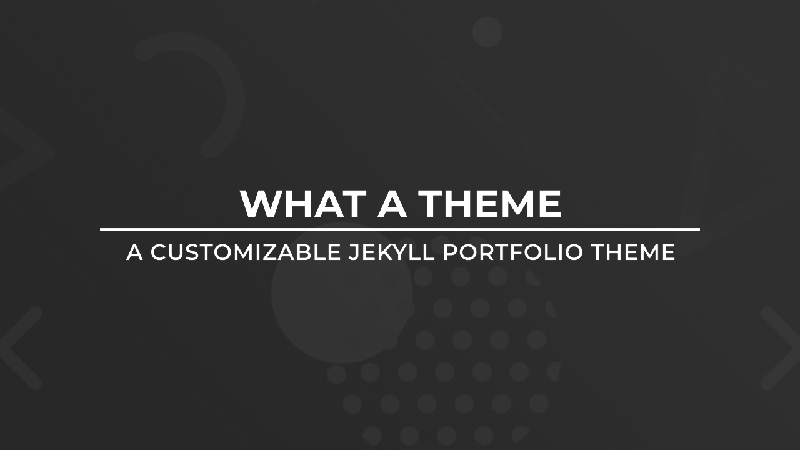

# Enyu Li's academic homepage

The homepage uses a simple academic layout. Existing blog posts and their URLs are preserved.

## Edit the profile

- Change the site name in `_config.yml` (`title`).
- Edit the introduction and research interests in `_data/profile.yml`.
- Update the main and alternate email addresses in `_config.yml` (`email` and `personal-email`).
- Add your photo under `assets/images/`, then set `photo` in `_data/profile.yml`
  (for example, `/assets/images/profile.jpg`). Until then, the homepage shows a photo placeholder.

## Add a note

Create a Markdown file such as `_notes/reading-note.md` with this front matter:

```yaml
---
title: A reading note
date: 2026-09-15
abstract: |
  Write your own abstract here. This can span
  several lines and supports **Markdown**.
# Optional: add a PDF under assets/notes/ and link it here.
# pdf: /assets/notes/reading-note.pdf
---
```

The abstract appears below the note on the homepage and in the Notes index, and on
the individual note page at `/notes/reading-note/`. Edit `abstract` in the existing
`_notes/*.md` files to add your own text. Leave `abstract: ""` to show no abstract.
You can write additional content below the front matter. If only the month is known, add
`date_precision: month` to display the month and year without a day. Use
`date_precision: none` for undated notes. Notes support Markdown
and mathematical notation (use Kramdown's `$$...$$` inline, or on a separate line for
display equations; write vertical bars as `\vert` so Markdown does not mistake them
for tables). Keep using
`_posts/` for blog posts. The original blog, categories, tags, feed, and both mathematical
labs remain available.

## Add photographs

The Photography page is at `/photography/`. Put web-sized copies of your photographs
in `assets/photography/`, and list them in `_data/photography.yml` in display order.
Add entries to the existing `photos` list, following this example:

```yaml
photos:
  # - image: /assets/photography/your-photo.jpg
  #   alt: A brief description of what appears in the photograph.
  #   title: Your photograph's title
  #   location: A location you want to display
  #   date: "Month and year, if known"
  #   width: 2400
  #   height: 1600
  #   featured: true
  #   full_image: /assets/photography/your-photo-large.jpg
```

`image` and descriptive `alt` text are required. All other fields are optional;
omit unknown dates and locations. Use the web copy's actual pixel dimensions for
`width` and `height`; images keep their original proportions. `featured: true`
spans the gallery's columns. Clicking a photograph opens `full_image`, or `image`
when no larger copy is supplied. Remove embedded GPS coordinates from web copies
if you do not want to share the precise shooting location.

The optional `quote` above the photo list has `text`, `attribution`, and `source`
fields. Keep the attribution and source link with the quotation.

## Blog style

Posts should read as standalone mathematical articles. Do not add notices about
adaptation from other platforms, screenshot sources, or correspondence to thesis
chapters. Preserve original publication dates in the post metadata.

## Search engines

Keep `url` in `_config.yml` set to the public site address. Academic pages include
an absolute canonical URL. `/sitemap.xml` automatically lists the homepage,
academic indexes, blog posts, notes, and linked note PDFs; `/robots.txt` points
search engines to it. New posts and notes appear in the sitemap on the next build.
Set `sitemap: false` in a page or note's front matter to omit it from the sitemap
(this does not prevent indexing). Submit `/sitemap.xml` in Google Search Console
after verifying ownership of the site.

---

# Original theme: WhatATheme
**WhatATheme** is a customizable Jekyll Portfolio theme which supports blogging. You can use this theme in order to create an elegant, fully responsive portfolio.

#### You can checkout the [**Demo Here**](https://thedevslot.github.io/WhatATheme/) :boom:



# Features :sparkles:
* Free and Easy setup
* No Coding Required
* Compatible with [Github Pages](https://pages.github.com/)
* Responsive and Blogging Ready
* HTML Compressor using [Jekyll Compress HTML](https://jch.penibelst.de/)
* Minified CSS using SaSS
* CMS Admin Support using [Jekyll Admin](https://jekyll.github.io/jekyll-admin/)
* Supports Latest [Jekyll 4.x](https://jekyllrb.com/) and [Bundler](https://bundler.io/)
* Stylesheet built using SaSS
* Comments using Disqus
* Analytics using Google Analytics
* Instant Search using [Simple Jekyll Search](https://github.com/christian-fei/Simple-Jekyll-Search/)

# Installation :books:
### System Requirements
* [Ruby](https://www.ruby-lang.org/en/)
* [Jekyll](https://jekyllrb.com/)
> You can read **What is Jekyll** [**here**](https://thedevslot.github.io/WhatATheme/blog/what-is-jekyll-how-to-use-it)
### Up and Running
* Fork the [Repository](https://github.com/thedevslot/WhatATheme/)
* Clone or download the repository into directory of your choice: `git clone https://github.com/thedevslot/WhatATheme.git`
* Inside the directory run `bundle install`
* Host WhatATheme locally by running `bundle exec jekyll s`

> You can read **How to Install and use WhatATheme?** [**here**](https://thedevslot.github.io/WhatATheme/blog/how-to-install-whatatheme)

[](https://youtu.be/VfPa2c9kwhQ)

---

### Content Credits :green_heart:
* [Hero Image](https://images.pexels.com/photos/220444/pexels-photo-220444.jpeg?auto=compress&cs=tinysrgb&dpr=2&h=650&w=940) used as a background image in the very first section of Homepage.
* [Author Image](https://cdn.pixabay.com/photo/2015/10/05/22/37/blank-profile-picture-973460_960_720.png) used in the Author Section.
* [Font Awesome](https://fontawesome.com/)
* [Poppins Font](https://fonts.google.com/specimen/Poppins)
* [Memphis Pattern](https://www.freepik.com/free-vector/memphis-pattern-background_4034913.htm#page=1&query=memphis%20pattern&position=23) used for some Social Media Images and the Favicon.

---

### Credits :bulb:
* [Sneha Omer](http://sassyecoder.github.io/)
* [Harsh Trivedi](http://harsh98trivedi.github.io/)

### License
The contents of this repository are licensed under the [**GNU General Public License v2.0**](https://github.com/thedevslot/WhatATheme/blob/master/LICENSE)
